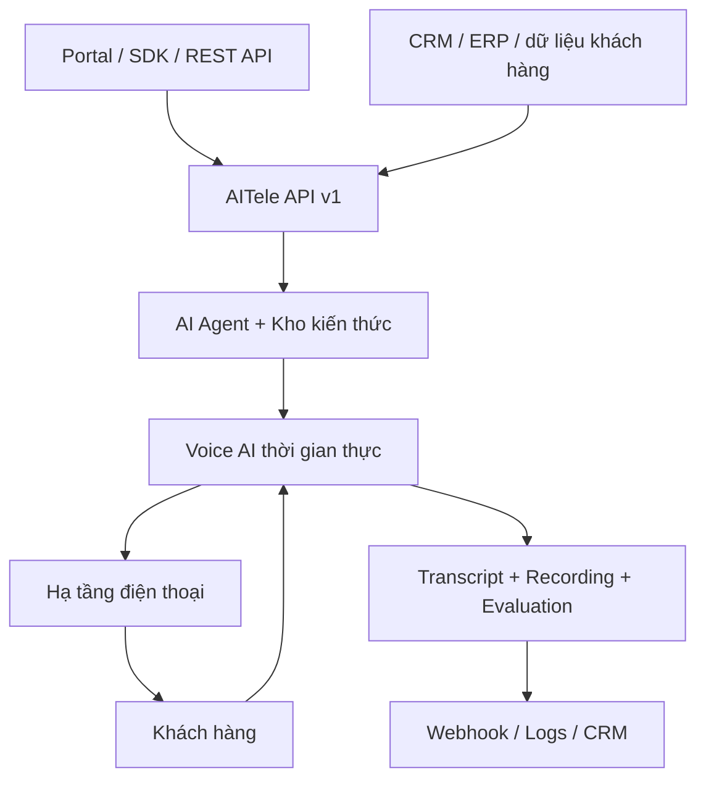

<p align="center">
  <a href="https://telecom.mtds.vn/">
    
  </a>
</p>

<h1 align="center">AITele — AI Voice Agent cho doanh nghiệp</h1>

<p align="center">
  <strong>Tự động gọi, hội thoại theo ngữ cảnh và ghi nhận kết quả — không cần xây hệ thống AI Voice từ đầu.</strong>
</p>

<p align="center">
  Dành cho doanh nghiệp muốn tự động hóa Telesales, CSKH, nhắc lịch, nhắc thanh toán<br />
  và developer muốn tích hợp Voice AI vào sản phẩm chỉ với vài dòng code.
</p>

<p align="center">
  <a href="https://www.npmjs.com/package/@mtdsdev/ai-telecom">
    
  </a>
  
  
  
  
</p>

<p align="center">
  <a href="https://telecom.mtds.vn/"><strong>🚀 Mở nền tảng</strong></a>
  ·
  <a href="https://telecom.mtds.vn/api-docs.html"><strong>📚 API Reference</strong></a>
  ·
  <a href="https://telecom.mtds.vn/openapi.yaml"><strong>🧩 OpenAPI</strong></a>
  ·
  <a href="https://www.npmjs.com/package/@mtdsdev/ai-telecom"><strong>📦 Node.js SDK</strong></a>
</p>

---

## ✨ AITele là gì?

AITele là nền tảng **AI Voice Agent hợp nhất** cho phép doanh nghiệp và developer xây dựng ứng dụng gọi điện bằng AI mà không phải tự ghép riêng lẻ hạ tầng viễn thông, nhận dạng giọng nói, tổng hợp giọng nói, mô hình ngôn ngữ, kho kiến thức và hệ thống đánh giá cuộc gọi.

Bạn chỉ cần:

1. **Xây dựng kịch bản cuộc gọi** — xác định vai trò, mục tiêu, cách xưng hô và nguyên tắc hội thoại.
2. **Thiết lập tiêu chí đánh giá** — quy định thế nào là khách hàng tiềm năng, cần theo dõi hoặc không quan tâm.
3. **Kết nối dữ liệu khách hàng** — truyền số điện thoại và `metadata` từ CRM, ERP hoặc ứng dụng của bạn.
4. **Khởi tạo cuộc gọi** — AITele thực hiện hội thoại và gửi kết quả về hệ thống qua API hoặc webhook.

Sau mỗi cuộc gọi, ứng dụng có thể nhận:

- Trạng thái và thời lượng cuộc gọi.
- Nội dung hội thoại theo từng lượt nói.
- Bản ghi âm qua URL có thời hạn.
- Điểm đánh giá, kết quả phân loại và bản tóm tắt.
- Chi phí, độ trễ và metadata dùng để đối soát với CRM.

> **Mục tiêu của AITele:** đưa một ý tưởng Voice AI từ kịch bản đến cuộc gọi thật nhanh nhất có thể, đồng thời vẫn cung cấp API/SDK đủ rõ ràng để tích hợp vào hệ thống sản xuất.

## 🎯 Các ứng dụng tiêu biểu

| Ứng dụng | AITele có thể hỗ trợ |
|---|---|
| 📞 **Telesales** | Gọi tư vấn, sàng lọc nhu cầu, chốt lịch và xác định khách hàng tiềm năng. |
| 🗓️ **Nhắc lịch hẹn** | Nhắc lịch khám, lịch tư vấn, lịch bảo trì; ghi nhận xác nhận hoặc yêu cầu đổi lịch. |
| 🎧 **Chăm sóc khách hàng** | Trả lời câu hỏi thường gặp, hướng dẫn và thu thập phản hồi sau dịch vụ. |
| 💳 **Thu hồi công nợ** | Nhắc khoản đến hạn theo kịch bản thân thiện, ghi nhận cam kết thanh toán. |
| 📊 **Khảo sát khách hàng** | Thu thập ý kiến sau mua hàng, sau sự kiện hoặc sau khi sử dụng dịch vụ. |
| 📦 **Xác nhận đơn hàng** | Xác nhận sản phẩm, số lượng, địa chỉ giao hàng và thời gian nhận hàng. |
| ✅ **Nhắc nhân viên** | Nhắc nhiệm vụ, deadline, ca làm việc hoặc quy trình nội bộ. |
| 👥 **Tuyển dụng** | Phỏng vấn sơ bộ, xác nhận kinh nghiệm, lịch phỏng vấn và mức độ phù hợp ban đầu. |
| 🧾 **Nhắc thanh toán** | Nhắc hóa đơn sắp đến hạn và hướng dẫn kênh thanh toán. |
| 🛎️ **AI Receptionist** | Tiếp nhận và định tuyến cuộc gọi đến theo ngữ cảnh *(đang phát triển)*. |

## 🇻🇳 Công nghệ giọng nói AI tiếng Việt

AITele được thiết kế cho hội thoại tiếng Việt theo thời gian thực:

- Phản hồi độ trễ thấp, phù hợp cho cuộc gọi hai chiều.
- Nhiều lựa chọn giọng nam/nữ và phong cách nói.
- Tùy chỉnh giọng, tốc độ và ngữ điệu trên nền tảng.
- Kịch bản linh hoạt theo những gì khách hàng nói, không chỉ đọc tuần tự một nội dung cố định.
- Kho kiến thức riêng giúp câu trả lời bám sát sản phẩm và chính sách của doanh nghiệp.

> Chất lượng thực tế phụ thuộc vào kịch bản, dữ liệu kho kiến thức, chất lượng đường truyền, cấu hình Agent và ngữ cảnh cuộc gọi. Hãy luôn chạy thử trước khi triển khai diện rộng.

## 🪄 Bắt đầu chỉ với 3 bước

Không cần biết lập trình để tạo và thử Agent đầu tiên trên Portal.

### 1. Tạo AI Agent

Đặt tên, chọn giọng nói, xác định cách xưng hô và soạn nội dung AI cần trao đổi với khách hàng.

### 2. Thêm kho kiến thức *(tùy chọn)*

Tải lên bảng giá, FAQ, tài liệu sản phẩm hoặc chính sách để AI trả lời theo dữ liệu đã được doanh nghiệp kiểm soát.

### 3. Thực hiện cuộc gọi thử

Nhập số điện thoại, bắt đầu cuộc gọi và kiểm tra hội thoại, bản ghi, transcript cùng kết quả đánh giá trước khi đưa vào vận hành.

## 🏗️ Kiến trúc tổng quan



Luồng tích hợp điển hình:

1. Ứng dụng gửi số điện thoại, `agentId`, kịch bản và `metadata`.
2. AITele phân giải cấu hình Agent, kho kiến thức, giọng nói và tiêu chí đánh giá.
3. Hệ thống thực hiện cuộc gọi, xử lý hội thoại theo thời gian thực.
4. Khi cuộc gọi kết thúc, AITele tạo transcript, tóm tắt, điểm số và kết quả phân loại.
5. Webhook `call.completed` đồng bộ kết quả trở lại CRM hoặc workflow của doanh nghiệp.

## 🌟 Tính năng nổi bật

| Tính năng | Giá trị |
|---|---|
| 🧩 **API/SDK hợp nhất** | Một lớp tích hợp cho Agent, cuộc gọi, số điện thoại, kho kiến thức, kết quả và mức sử dụng. |
| 💬 **Hội thoại tự nhiên** | AI phản hồi theo nội dung khách hàng nói thay vì đọc kịch bản cứng nhắc. |
| ♻️ **Agent tái sử dụng** | Lưu kịch bản, giọng nói, tiêu chí đánh giá và kho kiến thức để dùng cho nhiều cuộc gọi. |
| 📚 **Kho kiến thức riêng** | Tải tài liệu doanh nghiệp để Agent trả lời theo nguồn thông tin được kiểm soát. |
| 🧠 **Đánh giá tự động** | Chấm điểm, phân loại kết quả và tóm tắt cuộc gọi theo tiêu chí do doanh nghiệp thiết lập. |
| 🔔 **Webhook thời gian thực** | Đẩy kết quả hoàn tất về CRM, ERP, dashboard hoặc automation workflow. |
| 🧾 **Transcript và recording** | Tra cứu hội thoại theo lượt nói và lấy URL bản ghi có thời hạn. |
| 📈 **Logs và usage** | Theo dõi trạng thái, thời lượng tính phí, chi phí ước tính, độ trễ và hạn mức. |
| 🏷️ **Metadata tùy chỉnh** | Gắn `crm_id`, `campaign_id`, `order_id` hoặc mã nghiệp vụ vào từng cuộc gọi. |
| 🚀 **Mở rộng theo hạn mức** | Bắt đầu từ cuộc gọi thử và tăng quy mô theo concurrency, quota và khung giờ của từng số. |

---

## ⚡ Quick start — Node.js / TypeScript

SDK Node.js chính thức đã sẵn sàng trên NPM:

```bash
npm install @mtdsdev/ai-telecom
```

Yêu cầu **Node.js 18+** vì SDK sử dụng `fetch` tích hợp sẵn.

### Tạo cuộc gọi AI đầu tiên

```ts
import { Client } from '@mtdsdev/ai-telecom';

const client = new Client({
  apiKey: process.env.AI_TELECOM_API_KEY!,
});

const call = await client.calls.create({
  to: '+84900000000',
  prompt: `
    Bạn là nhân viên tư vấn của công ty ABC.
    Hãy chào khách hàng lịch sự, xác nhận nhu cầu
    và đề nghị một lịch hẹn nếu khách hàng quan tâm.
  `,
  evaluation: `
    Chấm điểm từ 0 đến 100 theo các tiêu chí:
    - Khách hàng có nhu cầu rõ ràng.
    - Khách hàng đồng ý nhận thêm thông tin.
    - Khách hàng đồng ý đặt lịch tư vấn.
  `,
  metadata: {
    crm_id: 'C-00042',
    campaign_id: 'summer-2026',
  },
});

console.log(call.id, call.status);
```

Biến môi trường:

```bash
AI_TELECOM_API_KEY=sk_live_...
```

> Không đưa API key vào frontend, ứng dụng di động, repository công khai hoặc ảnh chụp màn hình. Hãy gọi AITele từ backend của bạn và lưu khóa bằng secret manager hoặc biến môi trường.

### Dùng lại một Agent đã lưu

```ts
const call = await client.calls.create({
  to: '+84900000000',
  agentId: 'agent_9fQz...',
  metadata: {
    crm_id: 'C-00042',
  },
});
```

### Gọi nhiều số

```ts
const calls = await client.calls.create({
  to: ['+84900000000', '+84900000001'],
  agentId: 'agent_9fQz...',
});
```

Việc lập lịch nên do hệ thống của bạn quản lý; đến thời điểm cần gọi, hãy gọi `client.calls.create(...)`.

### Đọc kết quả

```ts
const result = await client.calls.get('call_Ku3n8pQ7...');

console.log({
  status: result.status,
  duration: result.duration,
  transcript: result.transcript,
  score: result.score,
  outcome: result.outcome,
  summary: result.summary,
  costUsd: result.usage?.costUsd,
  latencyMs: result.usage?.latencyMs,
});

const recording = await client.calls.recordingUrl(result.id);
console.log(recording.url);
```

Các trạng thái chính gồm:

```text
queued → dialing → ringing → in_progress → completed
```

Cuộc gọi cũng có thể kết thúc ở `no_answer`, `failed` hoặc `cancelled`.

### Lọc và duyệt danh sách cuộc gọi

```ts
const completed = await client.calls.list({
  status: 'completed',
  scoreMin: 70,
  from: '2026-07-01',
  until: '2026-07-31',
});

for await (const call of client.calls.iter({ outcome: 'potential' })) {
  console.log(call.to, call.score);
}
```

### Hủy hoặc chờ cuộc gọi

```ts
await client.calls.cancel('call_Ku3n8pQ7...');

const done = await client.calls.wait('call_Ku3n8pQ7...', {
  timeout: 600,
});
```

`wait()` phù hợp với script và thử nghiệm. Trong môi trường production, nên dùng webhook `call.completed`.

## 🐍 Quick start — Python

```bash
pip install ai-telecom
```

```python
import os
from ai_telecom import Client

client = Client(api_key=os.environ["AI_TELECOM_API_KEY"])

call = client.calls.create(
    to="+84900000000",
    prompt="""
    Bạn là nhân viên tư vấn của công ty ABC.
    Chào khách hàng, xác nhận nhu cầu và đề nghị lịch hẹn phù hợp.
    """,
    metadata={"crm_id": "C-00042"},
)

print(call.id, call.status)
```

---

## 🤖 Quản lý AI Agent

Agent là cấu hình có thể tái sử dụng gồm kịch bản, tiêu chí đánh giá, giọng nói và kho kiến thức.

```ts
const agent = await client.agents.create({
  name: 'Tư vấn gói dịch vụ',
  prompt: `
    Bạn là chuyên viên tư vấn của công ty ABC.
    Hãy tìm hiểu nhu cầu trước khi giới thiệu giải pháp.
    Không tự tạo giá, chính sách hoặc cam kết ngoài kho kiến thức.
  `,
  evaluation: `
    Chấm 0–100 theo mức độ quan tâm.
    Trích xuất nhu cầu chính và hành động tiếp theo.
  `,
  isDefault: true,
});

await client.calls.create({
  to: '+84900000000',
  agentId: agent.id,
});

await client.agents.update(agent.id, {
  prompt: 'Kịch bản đã được cập nhật...',
});
```

Thứ tự phân giải kịch bản:

```text
prompt trực tiếp → agent trực tiếp → agentId → Agent mặc định
```

Khi tạo cuộc gọi, cấu hình đã phân giải được chụp lại tại thời điểm đó. Việc chỉnh sửa Agent sau này không làm thay đổi lịch sử cuộc gọi đã chạy.

## 📝 Mẫu xây dựng kịch bản cuộc gọi

Một prompt tốt nên có cấu trúc rõ ràng:

```text
VAI TRÒ
Bạn là nhân viên chăm sóc khách hàng của [doanh nghiệp].

MỤC TIÊU
Xác nhận khách hàng đã nhận sản phẩm và thu thập mức độ hài lòng.

NGỮ CẢNH
Khách hàng: {{customer_name}}
Sản phẩm: {{product_name}}
Mã đơn: {{order_id}}

QUY TRÌNH
1. Chào và xin phép trao đổi.
2. Xác minh đúng người nhận.
3. Hỏi tình trạng đơn hàng.
4. Ghi nhận phản hồi.
5. Tóm tắt và kết thúc lịch sự.

NGUYÊN TẮC
- Không tự tạo thông tin ngoài kho kiến thức.
- Không yêu cầu mật khẩu, OTP hoặc dữ liệu thẻ.
- Nếu khách yêu cầu không gọi lại, phải ghi nhận ngay.
- Nếu không chắc chắn, hẹn nhân viên phụ trách liên hệ lại.

KẾT QUẢ MONG MUỐN
Xác định: hài lòng / cần hỗ trợ / yêu cầu gọi lại / không liên hệ lại.
```

### Tiêu chí đánh giá gợi ý

```text
Chấm điểm cuộc gọi từ 0 đến 100:

- 30 điểm: xác định đúng nhu cầu.
- 25 điểm: khách đồng ý nhận tư vấn tiếp.
- 25 điểm: khách đồng ý thời gian liên hệ hoặc lịch hẹn.
- 20 điểm: thông tin liên hệ và hành động tiếp theo rõ ràng.

Phân loại:
- potential: từ 70 điểm trở lên.
- follow_up: cần nhân viên liên hệ lại.
- not_interested: khách không quan tâm hoặc yêu cầu dừng.

Tóm tắt:
- Nhu cầu chính.
- Mối quan tâm hoặc phản đối.
- Cam kết của khách hàng.
- Hành động tiếp theo.
```

Nếu không truyền `evaluation`, cuộc gọi vẫn chạy nhưng sẽ không có `score`, `outcome` hoặc `summary` từ bước đánh giá.

---

## 📚 Kho kiến thức

Kho kiến thức là một tập hợp tài liệu để Agent tham khảo khi khách hàng đặt câu hỏi.

```ts
const kb = await client.knowledgeBases.create({
  name: 'Bảng giá và FAQ 2026',
});

await client.knowledgeBases.documents.create(kb.id, {
  name: 'Thông tin gói dịch vụ',
  content: `
    Gói Cơ bản có giá hai trăm nghìn đồng mỗi tháng.
    Thời gian triển khai dự kiến từ hai đến ba ngày làm việc.
  `,
});

await client.knowledgeBases.documents.upload(kb.id, 'bang-gia.pdf');
await client.knowledgeBases.wait(kb.id);

const agent = await client.agents.create({
  name: 'Tư vấn bán hàng',
  prompt: 'Tư vấn dựa trên kho kiến thức được cung cấp.',
  knowledgeBaseId: kb.id,
});
```

Các định dạng tài liệu được SDK hiện tại hỗ trợ tải lên gồm:

```text
PDF · DOCX · PPTX · XLSX · HTML · TXT · Markdown
```

Lưu ý vận hành:

- Tài liệu tải lên được xử lý bất đồng bộ; hãy chờ `processing_count == 0`.
- Kiểm tra `failed_count` và lỗi của từng tài liệu trước khi gọi.
- Chỉ bật những tài liệu/phần thực sự cần thiết để kiểm soát chi phí ngữ cảnh.
- Nên viết số theo cách cần đọc thành tiếng, ví dụ “hai trăm nghìn đồng”.
- Tài liệu phải có phiên bản, ngày hiệu lực và người chịu trách nhiệm cập nhật.

---

## 🔔 Webhooks

Thiết lập URL webhook cho API key trên Console. Khi cuộc gọi hoàn tất, AITele gửi sự kiện `call.completed` đến backend của bạn.

```ts
import express from 'express';
import {
  webhooks,
  WebhookVerificationError,
} from '@mtdsdev/ai-telecom';

const app = express();

app.post(
  '/webhooks/ai-telecom',
  express.raw({ type: '*/*' }),
  (req, res) => {
    try {
      const event = webhooks.verify(
        req.body as Buffer,
        String(req.headers['x-signature'] ?? ''),
        process.env.AI_TELECOM_WEBHOOK_SECRET!,
      );

      console.log(event.event, event.data.id, event.data.score);
      res.sendStatus(200);
    } catch (error) {
      if (error instanceof WebhookVerificationError) {
        return res.sendStatus(400);
      }
      throw error;
    }
  },
);
```

Yêu cầu bảo mật:

- Xác minh chữ ký HMAC-SHA256 trong header `X-Signature`.
- Dùng **raw request body**; không parse JSON trước khi xác minh.
- So sánh chữ ký theo constant time — SDK đã thực hiện bước này.
- Thiết kế webhook theo hướng idempotent vì một sự kiện có thể được gửi lại.
- Chỉ cập nhật CRM sau khi chữ ký hợp lệ.

## ☎️ Số điện thoại và hạn mức

Số điện thoại được quản trị viên cấp và ánh xạ với SIP line/trunk.

```ts
const numbers = await client.phoneNumbers.list();

for (const number of numbers) {
  console.log({
    id: number.id,
    number: number.number,
    trunk: number.trunk,
    quotaRemaining: number.quotaRemaining,
  });
}

await client.calls.create({
  to: '+84900000000',
  prompt: '...',
  fromNumber: '0592014235',
});
```

`fromNumber` có thể là số hiển thị, SIP extension hoặc tên trunk. Nếu bỏ qua, nền tảng sử dụng số đang hoạt động đầu tiên của tài khoản.

Mỗi số có thể có:

- Giới hạn số cuộc gọi đồng thời.
- Hạn mức phút gọi.
- Khung giờ được phép gọi.

Phút tính phí được làm tròn theo từng cuộc gọi đã kết nối:

```text
billable_minutes = ceil(duration_seconds / 60)
```

## 📈 Usage và Logs

```ts
const usage = await client.usage.get({
  from: '2026-07-01',
});

console.log(usage.total?.calls);
console.log(usage.total?.minutes);
```

Sử dụng `metadata` để đối soát cuộc gọi với dữ liệu nội bộ:

```ts
await client.calls.create({
  to: '+84900000000',
  agentId: 'agent_9fQz...',
  metadata: {
    crm_id: 'C-00042',
    order_id: 'ORD-2026-001',
    campaign_id: 'renewal-july',
  },
});
```

---

## 🔐 Authentication và xử lý lỗi

Khởi tạo client:

```ts
const client = new Client({
  apiKey: process.env.AI_TELECOM_API_KEY!,
  timeoutMs: 30_000,
  maxRetries: 2,
});
```

SDK tự retry lỗi mạng, `429` và `5xx` với backoff. Các lỗi logic như `400`, `401`, `403`, `404` và `422` không được retry tự động.

```ts
import {
  AITelecomError,
  AuthenticationError,
  PermissionError,
  NotFoundError,
  ValidationError,
  RateLimitError,
  ServerError,
  APIConnectionError,
} from '@mtdsdev/ai-telecom';

try {
  await client.calls.create({
    to: 'not-a-number',
    prompt: '...',
  });
} catch (error) {
  if (error instanceof ValidationError) {
    console.error(error.code, error.message);
  } else if (error instanceof RateLimitError) {
    console.error('Thử lại sau:', error.retryAfter);
  } else if (error instanceof AITelecomError) {
    console.error(error.message);
  }
}
```

## 🧭 Tài liệu và trạng thái phát triển

| Nhóm | Nội dung | Trạng thái |
|---|---|---|
| **Console** | Overview, API Keys, Webhooks, Logs | ✅ Khả dụng |
| **Getting started** | Introduction, Quick start, Installation, Authentication | ✅ Khả dụng |
| **Tutorials** | Make your first AI call | ✅ Khả dụng |
| **Tutorials** | AI Receptionist | 🧪 Sắp ra mắt |
| **Tutorials** | AI Sales Agent | 🧪 Sắp ra mắt |
| **Tutorials** | AI Customer Support | 🧪 Sắp ra mắt |
| **Resources** | Knowledge Base, Phone Numbers | ✅ Khả dụng |
| **Resources** | SIP Trunk tự cấu hình | 🧪 Sắp ra mắt |
| **SDK** | Python, Node.js / TypeScript | ✅ Khả dụng |
| **SDK** | Go, Java, PHP, C# | 🧪 Sắp ra mắt |
| **Examples** | Outbound Call | ✅ Khả dụng |
| **Examples** | Inbound Call, Streaming, Function Calling, Knowledge Search | 🧪 Sắp ra mắt |
| **More** | Playground | 🧪 Sắp ra mắt |
| **Reference** | API Reference, OpenAPI, Release Notes | ✅ / đang mở rộng |

> “Sắp ra mắt” biểu thị định hướng phát triển, không phải cam kết về ngày phát hành. Hãy theo dõi Release Notes để biết trạng thái mới nhất.

## 🧱 API resources

| Resource | Mục đích |
|---|---|
| `calls` | Tạo, đọc, lọc, chờ, hủy cuộc gọi và lấy recording URL. |
| `agents` | Tạo và tái sử dụng cấu hình AI Agent. |
| `knowledgeBases` | Quản lý kho kiến thức và tài liệu. |
| `phoneNumbers` | Xem số điện thoại, trunk và hạn mức. |
| `usage` | Theo dõi cuộc gọi, phút sử dụng và chi phí. |
| `webhooks` | Xác minh sự kiện hoàn tất cuộc gọi. |

SDK Node.js dùng **camelCase** như `agentId`, `fromNumber`, `knowledgeBaseId`; dữ liệu HTTP theo OpenAPI vẫn dùng `snake_case`.

SDK hiện ghim vào `/api/v1`. Thay đổi phá vỡ tương thích sẽ đi qua phiên bản API/SDK lớn mới; trường phản hồi mới không làm hỏng client cũ.

## ✅ Checklist trước khi chạy production

- [ ] Kịch bản đã được thử với nhiều cách trả lời và tình huống ngắt lời.
- [ ] Tiêu chí đánh giá có thể kiểm chứng và không mơ hồ.
- [ ] Kho kiến thức chỉ chứa thông tin đã duyệt, còn hiệu lực.
- [ ] API key và webhook secret được lưu trong secret manager.
- [ ] Webhook đã xác minh chữ ký và xử lý idempotent.
- [ ] CRM lưu `call.id`, `metadata`, trạng thái và hành động tiếp theo.
- [ ] Đã kiểm tra concurrency, quota, khung giờ gọi và chi phí.
- [ ] Có cơ chế chuyển cho nhân viên khi AI không đủ thông tin.
- [ ] Có quy trình xử lý yêu cầu không gọi lại.
- [ ] Đã xem xét nghĩa vụ thông báo, đồng ý ghi âm và bảo vệ dữ liệu.

## ⚖️ Sử dụng có trách nhiệm

Người triển khai chịu trách nhiệm tuân thủ quy định pháp luật và chính sách nội bộ liên quan đến cuộc gọi tự động, quảng cáo, bảo vệ dữ liệu cá nhân và ghi âm cuộc gọi.

Nên áp dụng tối thiểu:

- Thông báo rõ người dùng đang tương tác với hệ thống AI khi phù hợp.
- Không giả mạo cá nhân, cơ quan hoặc thương hiệu.
- Không thu thập mật khẩu, OTP, mã PIN hoặc thông tin thẻ qua Agent.
- Tôn trọng yêu cầu từ chối, danh sách không liên hệ và khung giờ gọi.
- Hạn chế dữ liệu cá nhân trong prompt, log, transcript và kho kiến thức.
- Phân quyền API key theo môi trường; thu hồi và xoay vòng khóa định kỳ.
- Thiết lập quy trình kiểm tra của con người đối với tình huống nhạy cảm.

## ❓ FAQ

<details>
<summary><strong>Tôi có phải tự xây STT, TTS, LLM và SIP không?</strong></summary>

Không. AITele cung cấp lớp API/SDK hợp nhất để bạn tập trung vào kịch bản, dữ liệu, tiêu chí đánh giá và tích hợp nghiệp vụ.
</details>

<details>
<summary><strong>Không biết lập trình có dùng được không?</strong></summary>

Có. Doanh nghiệp có thể tạo Agent, thêm kho kiến thức và thực hiện cuộc gọi thử trên Portal. API/SDK dành cho tích hợp sâu với sản phẩm và hệ thống nội bộ.
</details>

<details>
<summary><strong>Có thể dùng chung một Agent cho nhiều chiến dịch không?</strong></summary>

Có. Bạn có thể tái sử dụng Agent và ghi đè `prompt`, `evaluation` hoặc kho kiến thức theo từng cuộc gọi khi cần.
</details>

<details>
<summary><strong>Làm sao đồng bộ kết quả về CRM?</strong></summary>

Gắn mã CRM vào `metadata`, sau đó nhận sự kiện `call.completed` qua webhook và cập nhật bản ghi tương ứng.
</details>

<details>
<summary><strong>Tại sao cuộc gọi không có score hoặc summary?</strong></summary>

Kiểm tra trường `evaluation`. Nếu không truyền tiêu chí đánh giá, AITele bỏ qua bước scoring và không trả `score`, `outcome` hoặc `summary`.
</details>

<details>
<summary><strong>URL bản ghi âm có công khai không?</strong></summary>

SDK trả về signed URL có thời hạn. Chỉ tạo URL khi cần và không lưu/chia sẻ ngoài phạm vi được phép.
</details>

## 🤝 Đóng góp và phản hồi

AITele hoan nghênh developer và doanh nghiệp:

- Trải nghiệm [Node.js SDK trên NPM](https://www.npmjs.com/package/@mtdsdev/ai-telecom).
- Gửi lỗi qua [GitHub Issues](https://github.com/xulytiengviet/aitele/issues).
- Đề xuất use case, ví dụ tích hợp hoặc cải tiến tài liệu.
- Không đăng API key, webhook secret, số điện thoại thật, transcript hoặc dữ liệu khách hàng vào issue công khai.

Khi report bug, vui lòng cung cấp:

```text
- Phiên bản SDK và Node.js/Python
- Hệ điều hành
- API resource đang sử dụng
- Mã lỗi và request ID (nếu có)
- Ví dụ tối giản đã loại bỏ khóa và dữ liệu cá nhân
- Kết quả mong đợi và kết quả thực tế
```

## 🔗 Liên kết

- 🌐 [AITele Platform](https://telecom.mtds.vn/)
- 📚 [API Reference](https://telecom.mtds.vn/api-docs.html)
- 🧩 [OpenAPI specification](https://telecom.mtds.vn/openapi.yaml)
- 📦 [Node.js SDK — `@mtdsdev/ai-telecom`](https://www.npmjs.com/package/@mtdsdev/ai-telecom)
- 🏢 [MTDS](https://mtds.vn/)

## 📄 License

Phát hành theo giấy phép **MIT**.

Copyright © MTDS.

---

<p align="center">
  <strong>AITele — Từ một kịch bản đến một cuộc gọi AI thực tế.</strong>
</p>

<p align="center">
  <a href="https://telecom.mtds.vn/">Bắt đầu ngay</a>
  ·
  <a href="https://telecom.mtds.vn/api-docs.html">Đọc tài liệu</a>
  ·
  <a href="https://github.com/xulytiengviet/aitele/issues">Report bug</a>
</p>
